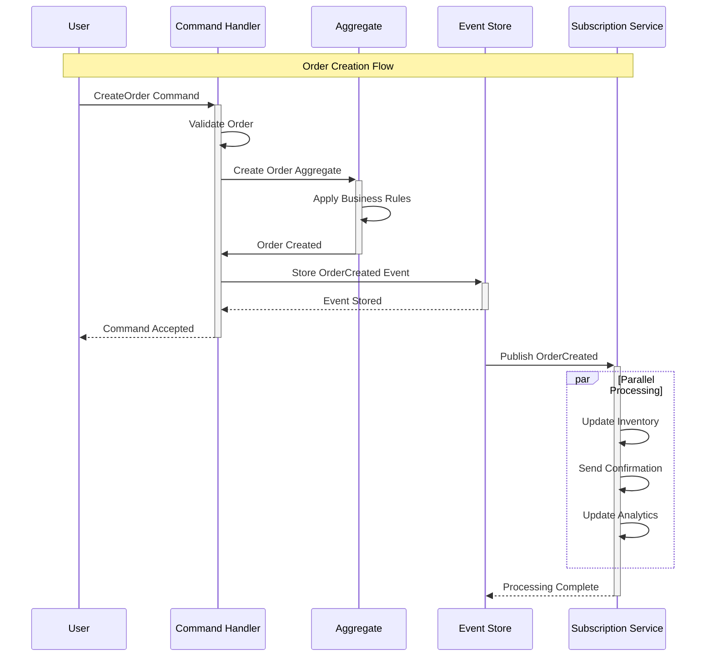

<!--
mode: auto
tools: vscode-markdown, mermaid-preview
-->

# 🔄 Event Storming Sequence Template

Create a sequence diagram for event-driven architecture analysis using event storming methodology.

## Requirements

- Domain scope: [bounded context/full domain]
- Event types: [domain/integration/system]
- Time scope: [single transaction/complete flow]
- Actor types: [user/system/external]

## Components

Define the following:
1. Domain Events
   - Event names
   - Triggering conditions
   - Data payload
2. Commands
   - Command handlers
   - Validation rules
   - Business logic
3. Aggregates
   - State changes
   - Invariants
   - Business rules
4. External Systems
   - Integration points
   - Contracts
   - Failures

## Styling Guidelines

- Color code by event type
- Use clear event naming
- Show causality chains
- Indicate parallel processing
- Mark aggregate boundaries

## Expected Output

A complete Mermaid sequence diagram showing the event flow.

## Example Format

## Additional Context

- Include compensation flows
- Note event versioning
- Document retry policies
- Specify consistency boundaries
- List business constraints
- Include timing requirements
- Document error scenarios
