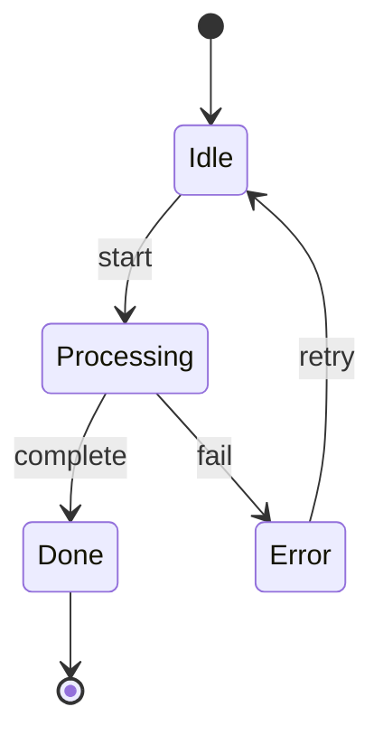

<!--
mode: auto
tools: vscode-markdown, mermaid-preview
-->

# Basic State Diagram Template

Create a state diagram showing the different states and transitions of a system with these specifications:

## Requirements

- System type: [simple/complex state machine]
- State transitions: [linear/branching/cyclic]
- Detail level: [basic/detailed/complete]

## Components

Define the following:
1. States: [list main states]
2. Transitions: [list state changes]
3. Events: [list triggering events]
4. Actions: [list actions on transitions]

## Styling Guidelines

- Use descriptive state names
- Show clear transition labels
- Include entry/exit actions if needed
- Group composite states when appropriate

## Expected Output

A complete Mermaid state diagram showing the system states and transitions.

## Example Format

## Additional Context

Specify any state invariants, timing constraints, or special conditions.
