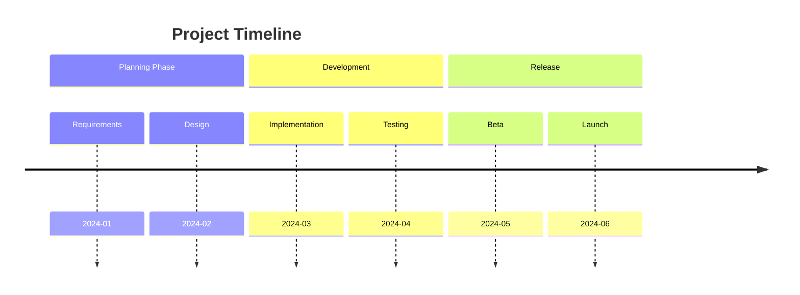

<!--
mode: auto
tools: vscode-markdown, mermaid-preview
-->

# Basic Timeline Template

Create a timeline showing sequential events or milestones with these specifications:

## Requirements

- Timeline scope: [historical/project/roadmap]
- Time range: [specify period]
- Detail level: [high-level/detailed]

## Components

Define the following:
1. Events: [list key moments]
2. Dates: [specify timepoints]
3. Categories: [group similar events]
4. Descriptions: [event details]

## Styling Guidelines

- Use clear event descriptions
- Show proper chronological order
- Include meaningful date formats
- Group related events

## Expected Output

A complete Mermaid timeline showing the sequence of events.

## Example Format

## Additional Context

Specify any temporal relationships, event dependencies, or milestone significance.
