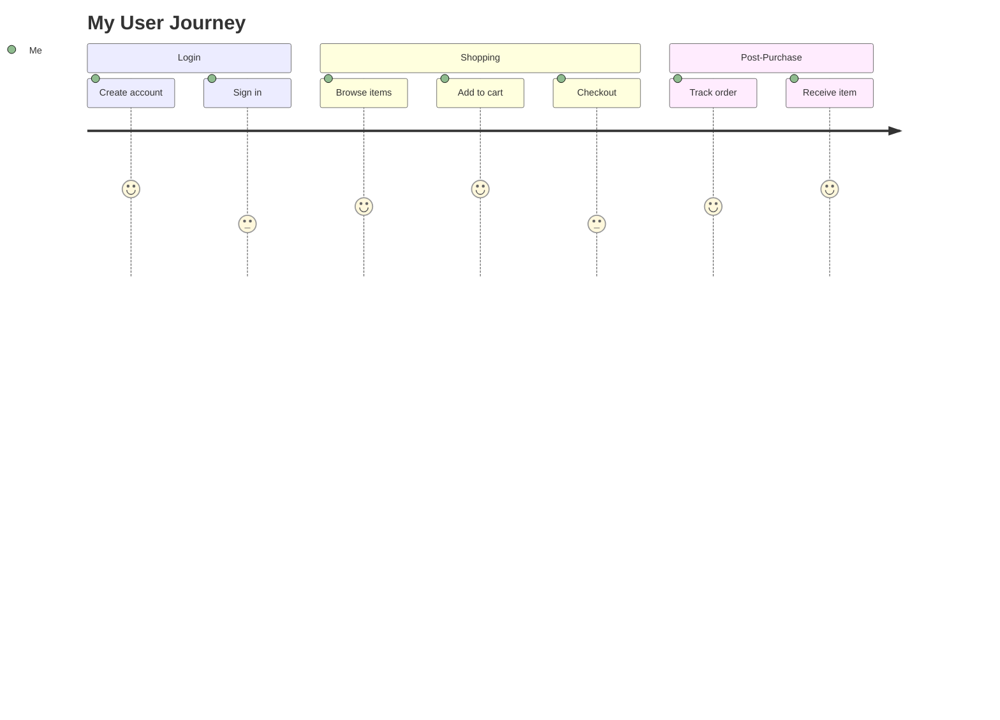

<!--
mode: auto
tools: vscode-markdown, mermaid-preview
-->

# Basic User Journey Template

Create a user journey diagram showing user interactions and experiences with these specifications:

## Requirements

- Journey scope: [single task/complete flow]
- User type: [specify persona]
- Journey complexity: [simple/detailed]

## Components

Define the following:
1. User tasks: [list key activities]
2. Sections: [journey phases]
3. Steps: [detailed interactions]
4. Experience indicators: [positive/negative/neutral]

## Styling Guidelines

- Use clear step descriptions
- Show proper task sequence
- Include emotion indicators
- Group related activities

## Expected Output

A complete Mermaid user journey diagram showing the user experience flow.

## Example Format

## Additional Context

Specify any user preferences, pain points, or key moments in the journey.
