<!--
mode: auto
tools: vscode-markdown, mermaid-preview
-->

# Basic XY Chart Template

Create an XY chart showing data points and relationships with these specifications:

## Requirements

- Chart type: [scatter/line/area]
- Data series: [single/multiple]
- Axis types: [linear/logarithmic]

## Components

Define the following:
1. Data points: [list coordinates]
2. Axes: [x and y scales]
3. Series: [data groupings]
4. Labels: [axis and point labels]

## Styling Guidelines

- Use clear axis labels
- Show gridlines if needed
- Include data point markers
- Add legend for multiple series

## Expected Output

A complete Mermaid XY chart showing the data distribution.

## Example Format

```mermaid
xychart-beta
    title "Temperature vs Time"
    x-axis [jan, feb, mar, apr, may] title "Month" 
    y-axis "Temperature (°C)" 
    line [12, 15, 18, 22, 25] title "Average"
    line [8, 10, 14, 18, 20] title "Minimum"
```

## Additional Context

Specify any scaling requirements, data ranges, or visualization preferences.
