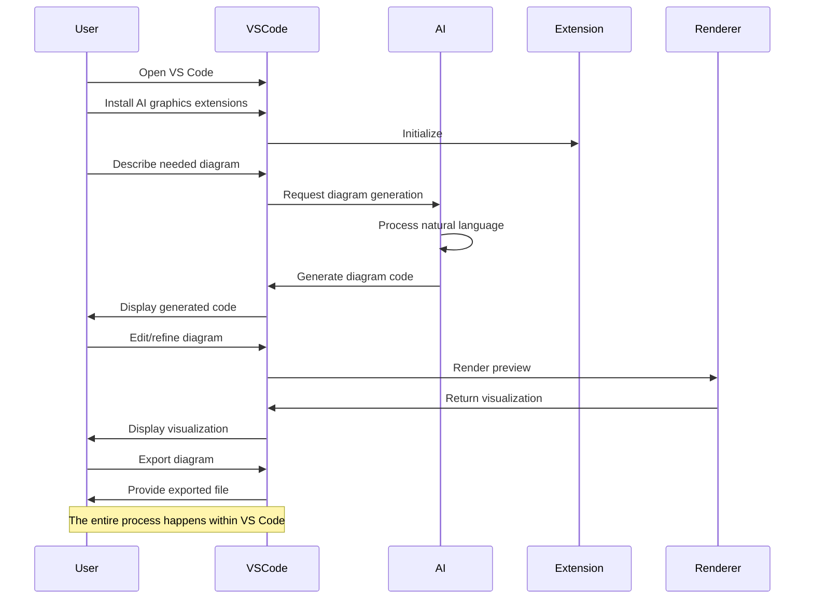

# ⏱️ Sequence Diagram Example: AI-Assisted Diagram Creation

This example demonstrates a sequence diagram created using Mermaid syntax, showing the interaction between a user, VS Code, and AI components during the diagram creation process.

## 📊 Diagram

## Navigation

- [🏠 Back to Main Page](README.md)
- **Related Documents:**
  - [Flowchart Example](flowchart_example.md)
  - [Implementation Guide](implementation_guide.md)
  - [Practical Mermaid Guide](practical_mermaid_guide.md)
