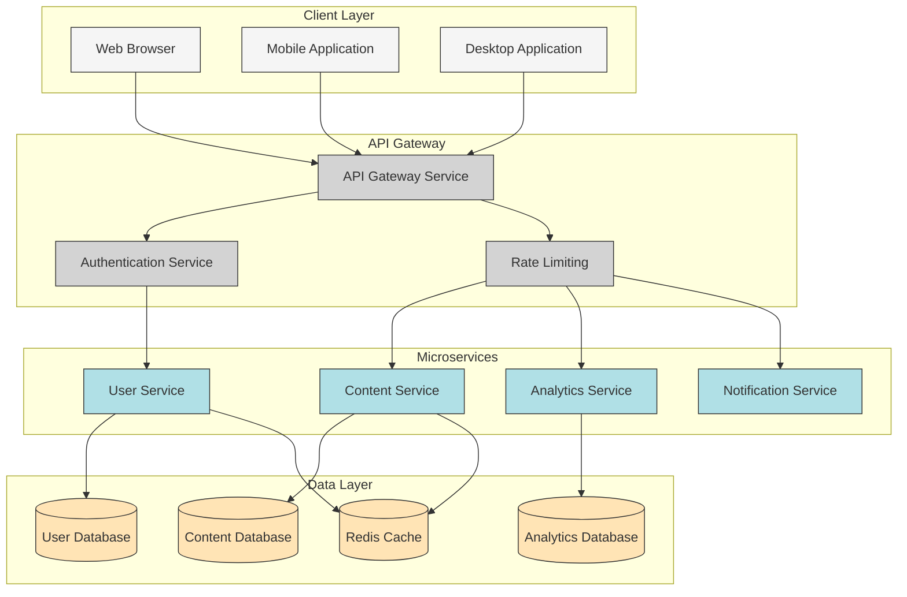

# 🏗️ System Architecture Example: Microservices Application

This example demonstrates a system architecture diagram created using Mermaid flowchart syntax, showing the components and layers of a modern microservices-based application.

## 📊 Diagram

## Navigation

- [🏠 Back to Main Page](README.md)
- **Related Documents:**
  - [Advanced Diagram Examples](advanced_diagram_examples.md)
  - [Class Diagram Example](class_diagram_example.md)
  - [AI Diagram Generation Guide](ai_diagram_generation_guide.md)
