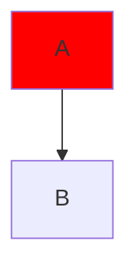
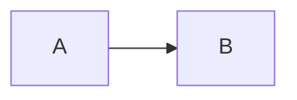
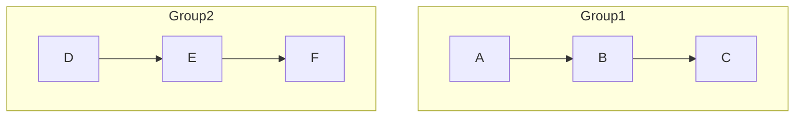
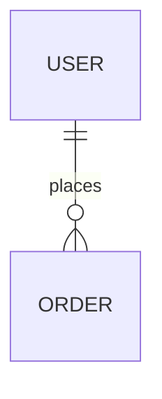
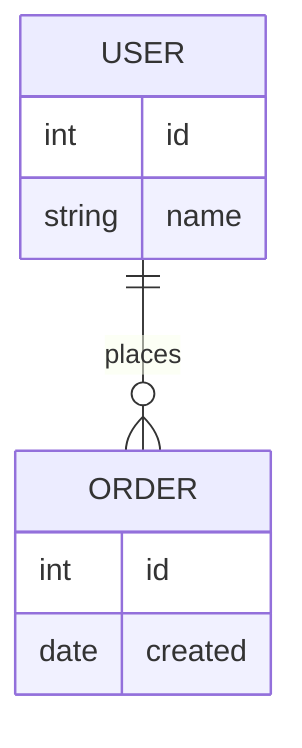
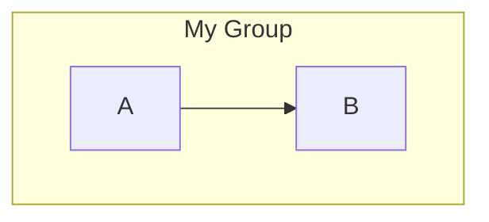

# Troubleshooting Mermaid Diagrams in VS Code

This guide addresses common issues encountered when creating diagrams with Mermaid in VS Code and provides solutions for resolving them.

## Common Syntax Errors

### 1. Reserved Keywords in Class Names

**Issue:** Using reserved Mermaid keywords like `end` as class names causes syntax errors.

```mermaid
flowchart TD
    A --> B
    classDef end fill:red
    class A end
```

**Error Message:** 
```
Syntax error in text: Parse error... Expecting 'AMP', 'COLON'... got 'end'
```

**Solution:** Avoid using reserved keywords like `end`, `style`, `linkStyle`, `classDef` as class names. Instead, use alternative names:



### 2. Improper Direction Specifiers

**Issue:** Using incorrect flow direction specifiers.

**Error:**
```mermaid
flowchart ABC
    A --> B
```

**Solution:** Use only valid direction specifiers: `TB` (top-bottom), `TD` (same as TB), `BT` (bottom-top), `RL` (right-left), or `LR` (left-right):



### 3. Inconsistent Indentation

**Issue:** Mermaid diagrams with inconsistent indentation sometimes render incorrectly.

**Solution:** Maintain consistent indentation throughout the diagram code, especially for subgraphs and nested structures:



### 4. Missing Relationship Definitions

**Issue:** Nodes referenced in relationships must be defined.

**Error:**


**Solution:** Ensure all entities in a relationship are properly defined:



### 5. Invalid Subgraph Syntax

**Issue:** Improper subgraph syntax causes rendering failures.

**Error:**
```mermaid
flowchart TD
    subgraph "My Group"
    A --> B
```

**Solution:** Ensure proper closing of subgraphs with `end`:



## VS Code-Specific Issues

### 1. Preview Not Updating

**Issue:** Mermaid diagram preview doesn't update when you edit the code.

**Solutions:**
- Save the file before previewing (Ctrl+S/Cmd+S)
- Toggle the preview closed and reopen it
- Ensure the Mermaid extension is up-to-date
- Try a different Mermaid extension (there are several options)

### 2. Export Problems

**Issue:** Unable to export diagrams or poor quality exports.

**Solutions:**
- Try the "Copy as PNG" option from the Mermaid Preview panel
- Install the "Markdown PDF" extension for PDF exports
- Use the browser-based Mermaid Live Editor for higher quality exports
- For CLI users, consider mermaid-cli for batch processing

### 3. Extension Conflicts

**Issue:** Multiple Mermaid extensions causing conflicts.

**Solution:** Disable all but one Mermaid extension. Recommended priority:
1. Markdown Preview Mermaid Support
2. Mermaid Preview
3. Markdown Preview Enhanced (if you need other features)

## Validation Tools

### 1. Using Online Validators

The [Mermaid Live Editor](https://mermaid.live/) is an excellent tool for validating diagrams:

1. Copy your diagram code (without the \```mermaid markers)
2. Paste into the live editor
3. Check for visual errors or syntax warnings
4. Fix the issues and copy the corrected code back to VS Code

### 2. Using Command Line Validation

Install the Mermaid CLI for local validation:

```bash
npm install -g @mermaid-js/mermaid-cli
```

Then validate a diagram:

```bash
mmdc -i path/to/your/diagram.mmd -o output.svg
```

If the diagram has syntax errors, the tool will report them.

### 3. VS Code Built-in Validation

Use VS Code's built-in Markdown Preview for basic validation:

1. Open the Markdown file containing your diagram
2. Press Ctrl+Shift+V (Cmd+Shift+V on Mac) to open the preview
3. If the diagram doesn't render, there's likely a syntax error

## Best Practices for Error Prevention

1. **Start simple, then add complexity:** Begin with a basic diagram and incrementally add elements.
2. **Use consistent styling:** Define classDef statements at the beginning or end of your diagram.
3. **Comment your code:** Add comments using `%%` to document complex sections.
4. **Version control your diagrams:** Keep track of working versions before making changes.
5. **Use proper indentation:** Makes it easier to spot missing `end` statements or other structural issues.
6. **Create templates:** Start new diagrams from known-working templates.
7. **Validate incrementally:** Check your diagram regularly as you add new elements.

## AI-assisted Diagram Troubleshooting

1. **Show the error:** When asking GitHub Copilot or other AI tools for help, include the exact error message.
2. **Provide context:** Show the full diagram code, not just the problematic section.
3. **Be specific:** Ask about a specific issue rather than general "what's wrong with this diagram" questions.
4. **Request explanations:** Ask the AI to explain why a correction works, to learn for next time.

By following these troubleshooting steps, you can resolve most common issues with Mermaid diagrams in VS Code.

## Navigation

- [🏠 Back to Main Page](README.md)
- **Related Documents:**
  - [Diagram Validation Guide](diagram_validation_guide.md)
  - [Diagram FAQ](diagram_faq.md)
  - [Practical Mermaid Guide](practical_mermaid_guide.md)
