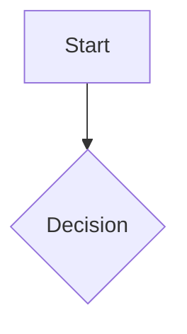

# Setting Up VS Code for Optimal Diagram Creation

This guide covers how to configure Visual Studio Code for the best possible diagram creation experience, including recommended extensions, settings, and workspace organization.

## Essential Extensions

Install these essential VS Code extensions to enhance your diagramming capabilities:

### 1. Mermaid Tools

- **[Markdown Preview Mermaid Support](https://marketplace.visualstudio.com/items?itemName=bierner.markdown-mermaid)**
  - Adds Mermaid diagram support to VS Code's built-in Markdown preview
  
- **[Mermaid Preview](https://marketplace.visualstudio.com/items?itemName=bierner.markdown-mermaid)**
  - Provides a dedicated preview pane for Mermaid diagrams

- **[Mermaid Editor](https://marketplace.visualstudio.com/items?itemName=tomoyukim.vscode-mermaid-editor)**
  - Interactive editor for creating and editing Mermaid diagrams

### 2. Diagram Editors

- **[Draw.io Integration](https://marketplace.visualstudio.com/items?itemName=hediet.vscode-drawio)**
  - Integrates the full Draw.io diagram editor directly into VS Code
  - Great for more complex or custom diagrams

- **[PlantUML](https://marketplace.visualstudio.com/items?itemName=jebbs.plantuml)**
  - Support for PlantUML diagrams
  - Requires Java and Graphviz for full functionality

### 3. Markdown Enhancements

- **[Markdown Preview Enhanced](https://marketplace.visualstudio.com/items?itemName=shd101wyy.markdown-preview-enhanced)**
  - Advanced Markdown preview with support for various diagram types
  - Includes math equations, charts, and more

- **[Markdown All in One](https://marketplace.visualstudio.com/items?itemName=yzhang.markdown-all-in-one)**
  - Keyboard shortcuts, TOC generation, and other Markdown tools

### 4. AI Assistants

- **[GitHub Copilot](https://marketplace.visualstudio.com/items?itemName=GitHub.copilot)**
  - AI pair programmer that can help generate diagram code
  
- **[GitHub Copilot Chat](https://marketplace.visualstudio.com/items?itemName=GitHub.copilot-chat)**
  - Conversational interface for working with Copilot

### 5. Version Control

- **[GitLens](https://marketplace.visualstudio.com/items?itemName=eamodio.gitlens)**
  - Enhanced Git capabilities to track changes to diagrams over time

## Recommended VS Code Settings

Add these settings to your `settings.json` file to optimize your diagramming workflow:

```json
{
  // General settings for a better editing experience
  "editor.tabSize": 2,
  "editor.renderWhitespace": "all",
  "editor.wordWrap": "on",
  "editor.formatOnSave": true,
  
  // Markdown settings
  "markdown.preview.breaks": true,
  "markdown.preview.scrollPreviewWithEditor": true,
  "markdown.extension.preview.autoShowPreviewToSide": false,
  
  // Draw.io settings
  "hediet.vscode-drawio.theme": "Kennedy",
  "hediet.vscode-drawio.codeLinkActivated": true,
  
  // Mermaid settings
  "markdown-preview-enhanced.mermaidTheme": "default",
  "markdown-preview-enhanced.previewTheme": "github-light",
  
  // PlantUML settings
  "plantuml.render": "PlantUMLServer",
  "plantuml.server": "https://www.plantuml.com/plantuml",
  
  // File explorer settings
  "explorer.compactFolders": false,
  "explorer.fileNesting.enabled": true,
  "explorer.fileNesting.patterns": {
    "*.md": "${capture}.svg, ${capture}.png, ${capture}.pdf"
  }
}
```

## Workspace Organization

Organize your diagrams effectively with this folder structure:

```
project/
├── docs/
│   ├── architecture/
│   │   ├── high-level-overview.md
│   │   ├── component-diagrams.md
│   │   └── deployment-diagram.md
│   ├── processes/
│   │   ├── user-authentication.md
│   │   └── order-processing.md
│   ├── data-models/
│   │   └── entity-relationships.md
│   └── assets/
│       ├── exported-diagrams/
│       └── images/
├── .vscode/
│   ├── settings.json
│   ├── extensions.json
│   └── tasks.json
└── README.md
```

## Setting Up Custom Tasks

Create a `.vscode/tasks.json` file to add custom tasks for diagram generation and export:

```json
{
  "version": "2.0.0",
  "tasks": [
    {
      "label": "Export Mermaid to SVG",
      "type": "shell",
      "command": "npx @mermaid-js/mermaid-cli mmdc -i ${file} -o ${fileDirname}/${fileBasenameNoExtension}.svg",
      "problemMatcher": [],
      "group": {
        "kind": "build",
        "isDefault": true
      }
    },
    {
      "label": "Export Mermaid to PNG",
      "type": "shell",
      "command": "npx @mermaid-js/mermaid-cli mmdc -i ${file} -o ${fileDirname}/${fileBasenameNoExtension}.png",
      "problemMatcher": [],
      "group": "build"
    },
    {
      "label": "Export PlantUML to SVG",
      "type": "shell",
      "command": "java -jar path/to/plantuml.jar -tsvg ${file}",
      "problemMatcher": [],
      "group": "build"
    }
  ]
}
```

## Keyboard Shortcuts

Add these custom keyboard shortcuts to your `keybindings.json`:

```json
[
  {
    "key": "alt+m p",
    "command": "markdown-preview-enhanced.openPreview",
    "when": "editorLangId == 'markdown'"
  },
  {
    "key": "alt+m e",
    "command": "markdown.showPreview",
    "when": "editorLangId == 'markdown'"
  },
  {
    "key": "alt+m s",
    "command": "workbench.action.tasks.runTask",
    "args": "Export Mermaid to SVG",
    "when": "editorLangId == 'markdown'"
  }
]
```

## Git Integration for Diagrams

Add this to your `.gitattributes` file to properly handle diagram files:

```
# Handle diagram files
*.drawio diff
*.drawio.svg diff
*.drawio.png diff=exif

# Handle Mermaid output files
*.mmd linguist-detectable=true
*.mmd linguist-language=Mermaid
```

And add this to your `.gitignore` file:

```
# Ignore temporary diagram files
*.bkp
*.dtmp

# Don't ignore exported diagrams
!docs/assets/exported-diagrams/*.svg
!docs/assets/exported-diagrams/*.png
```

## Setting Up Extensions Auto-Install

Create a `.vscode/extensions.json` file to recommend extensions to team members:

```json
{
  "recommendations": [
    "bierner.markdown-mermaid",
    "tomoyukim.vscode-mermaid-editor",
    "hediet.vscode-drawio",
    "jebbs.plantuml",
    "shd101wyy.markdown-preview-enhanced",
    "yzhang.markdown-all-in-one",
    "github.copilot",
    "github.copilot-chat",
    "eamodio.gitlens"
  ]
}
```

## Setting Up a Custom Theme for Diagrams

For consistent styling across all your diagrams, create a custom theme file. For Mermaid, create a `mermaid-theme.json` file:

```json
{
  "theme": "base",
  "themeVariables": {
    "primaryColor": "#5a67d8",
    "primaryTextColor": "#fff",
    "primaryBorderColor": "#4c51bf",
    "lineColor": "#5a67d8",
    "secondaryColor": "#6b7280",
    "tertiaryColor": "#f0f5ff"
  }
}
```

Then reference this in your Markdown files:

```markdown

```

## Integration with Documentation Tools

If you're using documentation tools like VitePress, Docusaurus, or MkDocs, add these configurations:

### VitePress

Install the Mermaid plugin:

```bash
npm install vitepress-plugin-mermaid -D
```

Update your `.vitepress/config.js`:

```javascript
import { withMermaid } from "vitepress-plugin-mermaid";

export default withMermaid({
  title: "My Documentation",
  description: "With beautiful diagrams",
  // other VitePress options...
  mermaid: {
    // Optional Mermaid config
    theme: 'neutral',
  },
});
```

### Docusaurus

Install the Mermaid plugin:

```bash
npm install @docusaurus/theme-mermaid
```

Update your `docusaurus.config.js`:

```javascript
module.exports = {
  themes: ['@docusaurus/theme-mermaid'],
  markdown: {
    mermaid: true,
  },
  themeConfig: {
    mermaid: {
      theme: { light: 'neutral', dark: 'forest' },
    },
  },
};
```

## Conclusion

With these configurations, your VS Code environment will be optimized for creating, editing, and managing diagrams. This setup ensures consistency across your documentation and makes it easier to maintain diagrams as your project evolves.
